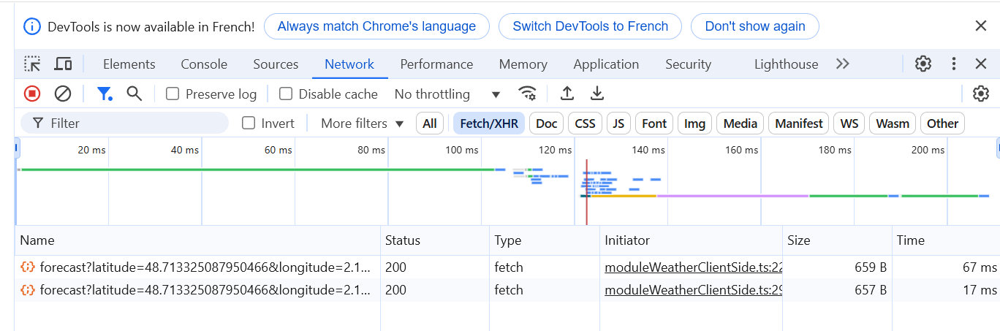

# 04_Client_or_server_side

:memo: [éditer cette page](https://gitlab.com/-/ide/project/webdev101/webdev101.gitlab.io/edit/main/-/public/04_client_or_server_side/README.md)

## démarrage du projet avec Astro

configurez un nouveau projet ASTRO avec les différents fichiers fournis puis démarrez le serveur.

# exercice : calcul côté client ou côté serveur ?

Regardez bien tous les fichiers source fournis dans le projet Astro. index.astro et moduleWeatherServerSide.ts sont dans le dossier src/pages et app.ts ainsi que moduleWeatherClientSide.ts sont dans le dossier src/scripts.

Ajoutez des console.log("message") juste avant les return (en changeant "message" par ce que vous voulez) dans les fonctions getCurrentHumidity getCurrentWind getCurrentTemperature et getCurrentCloudCover.

Où s'affichent les 4 messages ? Dans le terminal du serveur Astro ou dans la console du navigateur ? Pourquoi ?

Ouvrez l'onglet "Network" de la console de développement de votre navigateur. Rechargez la page. Observez que DEUX requêtes de type FETCH sont envoyées au serveur api.open-meteo.com.

Répondez aux question dans un fichier reponses.md à la racine de votre projet.